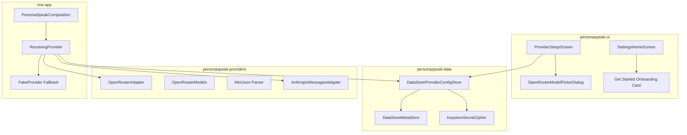

# Milestone 5 Plan: Onboarding, Settings UI, and OpenRouter Multi-Provider Integration

**Parent Issue:** [#38](https://github.com/apexcloudwise/personaspeak/issues/38) (Milestone 5)  
**Tracking Issue:** [#103](https://github.com/apexcloudwise/personaspeak/issues/103) (Kickoff)  
**Related ADR:** [ADR-0009: Pluggable Multi-Provider Architecture and OpenRouter Evaluation](../adr/0009-pluggable-multi-provider-and-openrouter.md)  
**Author:** Rei (Pixel Perfect Studios)  
**Date:** 2026-08-27  

---

## 1. Goal & Architecture Overview

Milestone 5 delivers end-user configuration and connectivity for remote AI provider backends, expanding beyond the default offline `FakeProvider` baseline to support live models via **OpenRouter** (and OpenAI-compatible proxies) while preserving complete privacy, zero secret logging, and deterministic offline fallbacks.

To accelerate delivery safely without regressions, Milestone 5 is partitioned into two focused slices:
- **Slice A (Foundation):** Architecture record (ADR-0009), dependency-free pure Kotlin `OpenRouterAdapter` & `OpenRouterModels` catalog parser in `:personaspeak-providers`, exhaustive contract tests, manifest network permission, and upstream rent ledgering.
- **Slice B (UI & Runtime Binding):** "The Brain" settings screen (`ProviderSetupScreen`), searchable model catalog browser dialog, "Get Started" onboarding card on Settings Home, and runtime provider resolution in `PersonaSpeakComposition` bound to Keystore storage.



---

## 2. Slice A: Provider Adapter & Contract Foundation

### 2.1 Component Specifications

| Component | Target Location | Responsibilities |
|---|---|---|
| `OpenRouterAdapter` | `personaspeak-providers/.../providers/OpenRouterAdapter.kt` | Implements `ProviderAdapter` for OpenRouter's OpenAI-compatible completions API (`https://openrouter.ai/api/v1/chat/completions`). |
| `OpenRouterModels` | `personaspeak-providers/.../providers/OpenRouterModels.kt` | Parses and filters OpenRouter's public `/models` catalog, identifying free models (`pricing.prompt == "0"`). |
| `MiniJson` | `personaspeak-providers/.../providers/MiniJson.kt` | Dependency-free recursive-descent JSON parser handling payloads without reflection. |
| `OpenRouterAdapterTest` | `personaspeak-providers/.../providers/OpenRouterAdapterTest.kt` | Contract tests against synthetic `HttpTransport` doubles asserting all status codes and extraction paths. |
| `OpenRouterModelsTest` | `personaspeak-providers/.../providers/OpenRouterModelsTest.kt` | Contract tests asserting free-first sorting and error resilience. |

### 2.2 Endpoint & Header Specifications

- **Completions Endpoint:** `https://openrouter.ai/api/v1/chat/completions` (pinned in `DefaultOpenRouterHttpTransport`).
- **Default Model:** `nvidia/nemotron-3-super-120b-a12b:free` (replaces deprecated `meta-llama/llama-3.3-70b-instruct:free`).
- **Headers:**
  - `Authorization: Bearer <API_KEY>`
  - `HTTP-Referer: https://pixelperfectstudios.biz`
  - `X-Title: PersonaSpeak`
  - `Content-Type: application/json; charset=utf-8`
- **Request Body:**
  ```json
  {
    "model": "nvidia/nemotron-3-super-120b-a12b:free",
    "messages": [
      {"role": "system", "content": "<SYSTEM_PROMPT>"},
      {"role": "user", "content": "<USER_TEXT>"}
    ],
    "temperature": 0.8
  }
  ```

### 2.3 Upstream Modifications & Rent Ledger

1. `android/keyboard/ime/app/src/main/AndroidManifest.xml`: Add `<uses-permission android:name="android.permission.INTERNET" />` to enable keyboard socket communication with remote AI providers upon user opt-in.
2. `android/keyboard/UPSTREAM-MODIFIED.md`: Record the manifest permission addition.

---

## 3. Slice B: Settings UI, Model Browser & Provider Opt-In

### 3.1 Components & UX Flow

1. **"The Brain" Settings Screen (`ProviderSetupScreen.kt`):**
   - Provider radio group (`OpenRouter`, `Claude (Anthropic)`, `OpenAI-compatible`).
   - Obfuscated API key password field with Save/Clear actions bound to Keystore via `ProviderConfigStore`.
   - Model selection text field with custom override support.
   - "Browse models…" dialog button (for OpenRouter) querying public catalog via `OpenRouterModels.fetch()`.
   - Searchable `OpenRouterModelPickerDialog` with search filter, free-first sorting, and "FREE" badges.
   - Custom base-URL classification: Non-secret DataStore metadata (stored in `ProviderMeta`), validated to `https://`.
2. **Settings Home & Onboarding Cards (`SettingsHomeScreen.kt`):**
   - "AI Brain" row reflecting active provider and configuration status.
   - "Get Started" onboarding card shown when unconfigured, linking to System IME settings and Brain configuration.
3. **Runtime Composition Binding (`PersonaSpeakComposition.kt` / `ResolvingProvider`):**
   - Resolves active provider from `ProviderConfigStore` on input view start (`onStartInputView`).
   - Falls back safely to `FakeProvider` if unconfigured or on storage failures.
   - Updates `SettingsState.lastRewriteResult: AdapterResult?` truthfully on rewrites (A4 invariant).
4. **Dependency & Build Wiring:**
   - Promoted `personaspeak-data` from `debugImplementation` to `implementation` in `:ime:app/build.gradle` so runtime IME composition can read the Keystore store.
   - Ledgered in `android/keyboard/UPSTREAM-MODIFIED.md`.

---

## 4. Verification & Quality Gates

### 4.1 Slice A Acceptance Criteria

- [x] **ADR-0009 Landed:** Architecture, config schema, custom base-URL classification, and privacy disclosures documented.
- [x] **Pure Kotlin Implementation:** `OpenRouterAdapter`, `OpenRouterModels`, and `MiniJson` contain zero `android.*` dependencies.
- [x] **Comprehensive Contract Tests:**
  - 200 OK text extraction with markdown/whitespace formatting.
  - 401/403 mapping to `AdapterResult.AuthFailure`.
  - 429 rate limit mapping to `NetworkErrorCode.HTTP_CLIENT_ERROR`.
  - 500/502/503 server errors mapping to `NetworkErrorCode.HTTP_SERVER_ERROR`.
  - Socket timeout mapping to `NetworkErrorCode.TIMEOUT`.
  - Memory zeroing of `SecretBytes` verified.
  - Pinned HTTPS endpoint verification.
  - MiniJson verified against real captured payloads (`or_chat.json`, `or_models.json`).
- [x] **Zero Secret Logging:** Verified by `NoSecretLoggingTest` and `verify-no-secret-logging.sh`.
- [x] **Upstream Rent Ledgered:** Manifest permission recorded in `UPSTREAM-MODIFIED.md`.
- [x] **Build & CI Clean:** `:personaspeak-providers:testDebugUnitTest`, `:ime:app:compileDebugKotlin`, and `verify-milestone-4.sh` pass.

### 4.2 Slice B Acceptance Criteria

- [x] **The Brain Settings Screen:** `ProviderSetupScreen.kt` implements radio selector, key field, model field, clear action, and privacy notice with 48dp touch floors.
- [x] **Searchable Model Browser:** `OpenRouterModelPickerDialog` dynamically browses public `/models` catalog with free badges and search filtering.
- [x] **Onboarding Guidance:** "Get started" card rendered on `SettingsHomeScreen` when unconfigured, with links to system keyboard settings and provider setup.
- [x] **Runtime Provider Resolution:** `ResolvingProvider` resolves configured brain on input start and delegates to `OpenRouterAdapter`/`AnthropicMessagesAdapter` or falls back to `FakeProvider`.
- [x] **Upstream Rent Ledgered:** `personaspeak-data` dependency promotion recorded in `UPSTREAM-MODIFIED.md`.
- [x] **Complete Quality Verification:**
  - All unit tests across `:personaspeak-ui`, `:personaspeak-data`, `:personaspeak-providers`, and `:ime:app` pass.
  - `verify-milestone-4.sh` passes (`PASS: milestone 4 gate`).
  - All 8 verifier fixture suites pass.
  - Clean debug APK assembly (`:ime:app:assembleDebug`).
