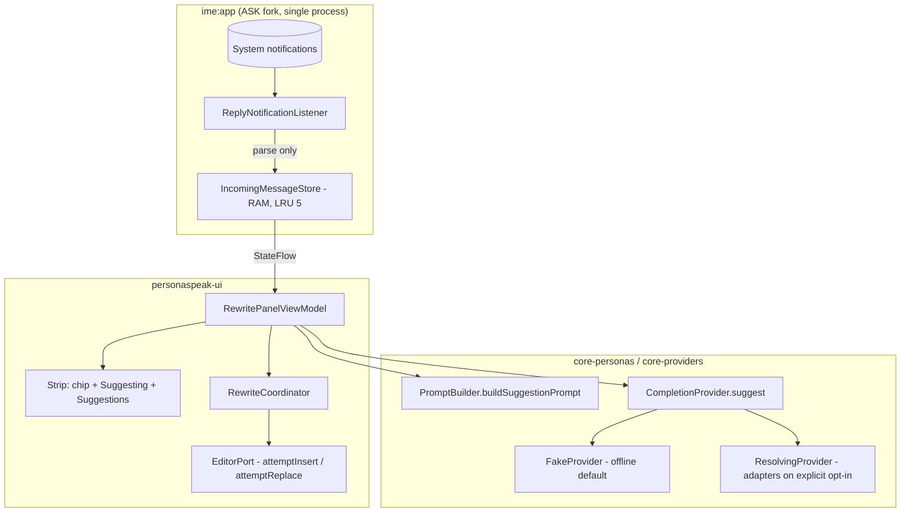

# Phase 2 Plan: Suggested Replies — Opt-In Notification Context, Offline Suggestion Strip, Privacy Receipts

**Tracking Issue:** [#120](https://github.com/apexcloudwise/personaspeak/issues/120)
**Roadmap:** `ROADMAP.md` Phase 2 (Suggested replies)
**Related ADRs:** [ADR-0002](../adr/0002-pluggable-provider-registry.md), [ADR-0005](../adr/0005-privacy-posture-fork-audit.md), [ADR-0009](../adr/0009-pluggable-multi-provider-and-openrouter.md) — extended by ADR-0010 in Slice A
**Author:** Seraph (Pixel Perfect Studios)
**Date:** 2026-09-01

---

## 1. Goal & Architecture Overview

Phase 2 ships the wow feature: the keyboard drafts replies to the message you just received, before you type anything. An opt-in `NotificationListenerService` holds the latest incoming message per conversation in RAM; the persona strip gains a "Replying to: …" context that generates three short drafts in the active persona and mood; tapping one inserts it into the focused editor as an editable draft through the guarded `EditorPort` contract. The demo runs end-to-end offline on `FakeProvider` ("The Understudy"), honoring the owner's standing mock-only ruling.

Per owner direction (2026-09-01, tracking issue), implementation lands as **one PR with slice-shaped commits**. Slices must leave the tree green at every commit boundary.

- **Slice A — Prompt + port:** ADR-0010, `buildSuggestionPrompt` + goldens, `CompletionProvider.suggest`, FakeProvider + ResolvingProvider, `desktop/personaspeak.py --suggest` parity.
- **Slice B — Listener + store + settings:** `ReplyNotificationListener`, manifest + rent ledger, `IncomingMessageStore`, settings destination + privacy copy + README.
- **Slice C — Strip UX:** `Suggesting`/`Suggestions` states, chip, three cards, regenerate, apply-through-EditorPort, forget-on-apply; dark/RTL/a11y floors.
- **Slice D — Evidence + patch note:** fresh-install emulator journey + device-class receipt + PATCHNOTES entry.



**Invariants carried from the tracking issue:** nothing read until the user grants notification access in system settings; message content never touches disk, logs, telemetry, or evidence; nothing is ever sent on the user's behalf (no auto-send, no marking-read, no remote-input replies); exactly one verified editor mutation per applied suggestion; the conversation is forgotten on apply.

---

## 2. Slice A: ADR-0010, Suggestion Prompt & Provider Port

### 2.1 Component Specifications

| Component | Target Location | Responsibilities |
|---|---|---|
| `ADR-0010` | `docs/adr/0010-opt-in-suggested-replies.md` | Records the privacy posture: opt-in notification access; RAM-only content, forgotten on reply; egress only via the user's configured provider on an explicit generate tap (ADR-0009 disclosure retained); the no-auto-send line; the `attemptInsert` contract extension. |
| `IncomingMessageContext` | `android/core-personas/src/main/kotlin/biz/pixelperfectstudios/personaspeak/personas/IncomingMessageContext.kt` | Pure data class: `sender: String?`, `appLabel: String`, `text: String`. No Android imports. |
| `PromptBuilder.buildSuggestionPrompt` | `android/core-personas/.../personas/PromptBuilder.kt` | Deterministic suggestion system prompt from persona + mood + `IncomingMessageContext` + count. Instructs N short numbered replies; same plain-prompt style as `build`. |
| Golden fixtures | `tests/golden/<persona>.suggest.txt` | Byte-identical goldens for the suggestion prompt (one per existing golden persona), regenerated via the Python reference. |
| `--suggest` CLI mode | `desktop/personaspeak.py` | Prints the suggestion prompt for a given persona/mood/incoming text/count. Keeps the Python-reference parity story true for the new prompt kind. |
| `CompletionProvider.suggest` | `android/core-providers/.../providers/CompletionProvider.kt` | `suspend fun suggest(system: String, text: String, count: Int): Result<List<String>>`. No default implementation — every provider answers honestly. |
| `NumberedSuggestions` | `android/core-providers/.../providers/NumberedSuggestions.kt` | Pure parser for N numbered lines from a single completion. Lenient: ≥1 parseable line succeeds; 0 fails through the existing error taxonomy. |
| `FakeProvider.suggest` | `android/core-providers/.../providers/FakeProvider.kt` | Deterministic, persona-flavored canned suggestions (three distinct registers), ~400 ms latency parity with `rewrite`. |
| `ResolvingProvider.suggest` | `android/keyboard/ime/app/.../ime/ResolvingProvider.kt` | Same resolution semantics as `rewrite`: unconfigured → FakeProvider; configured → one adapter completion, parsed by `NumberedSuggestions`. |

**Design note — adapters need no interface change.** `ProviderAdapter` (HTTP level) still returns a single completion. The N-suggestions contract is carried inside the prompt (numbered list) and parsed by `NumberedSuggestions`; this keeps Slice A additive across `:personaspeak-providers` with zero adapter signature churn.

### 2.2 Slice A Acceptance Criteria

- [ ] ADR-0010 landed in ADR-0009's format; scope matches the tracking issue's pre-ruled decisions.
- [ ] `:core-personas` and `:core-providers` additions contain zero `android.*` imports.
- [ ] Golden fixtures added, none deleted; `PromptBuilderGoldenTest` extended; Python parity verified via `--suggest`.
- [ ] Contract tests: FakeProvider determinism/count/latency; `NumberedSuggestions` parser (clean, malformed, empty, N≠lines); ResolvingProvider fallback + delegation.
- [ ] `desktop/test_validate_personas.py` and the CI personas-and-cli job stay green.

---

## 3. Slice B: Listener, Store, Settings & Privacy Copy

### 3.1 Component Specifications

| Component | Target Location | Responsibilities |
|---|---|---|
| `ReplyNotificationListener` | `android/keyboard/ime/app/src/main/kotlin/biz/pixelperfectstudios/personaspeak/ime/reply/ReplyNotificationListener.kt` | `NotificationListenerService`; `onNotificationPosted` → parse → `IncomingMessageStore`. Parsing only; no disk, no logging of content, no read-marking. |
| Manifest declaration | `android/keyboard/ime/app/src/main/AndroidManifest.xml` | `<service android:permission="android.permission.BIND_NOTIFICATION_LISTENER_SERVICE">` with intent filter. Rent-ledgered. |
| Rent ledger entry | `android/keyboard/UPSTREAM-MODIFIED.md` | One bullet for the manifest service declaration. |
| `IncomingMessageStore` | `android/personaspeak-ui/src/main/kotlin/biz/pixelperfectstudios/personaspeak/ui/reply/IncomingMessageStore.kt` | Pure in-memory, process-wide singleton (same pattern as `PersonaSpeakSessionState`): conversation-keyed map, latest-wins, LRU cap 5, `forget(key)`, `clearAll()`, `StateFlow` for strip reactivity. |
| Settings destination | `android/personaspeak-ui/.../ui/settings/` — `SettingsDestination.SuggestedReplies` + `SuggestedRepliesScreen.kt` | Access status (`NotificationManagerCompat.getEnabledListenerPackages`), deep link to `ACTION_NOTIFICATION_LISTENER_SETTINGS`, privacy copy block, "what we never do" lines. |
| Settings home card | `android/personaspeak-ui/.../ui/settings/SettingsHomeScreen.kt` | Row card surfacing the feature and its status. |
| README privacy section | `README.md` | "Suggested replies & your notifications": what's read, what's kept (RAM-only, forgotten on reply), when anything leaves the device (never, except the explicit generate call to the user's configured provider — ADR-0009 disclosure intact). |
| Audit test update | `ReleasePrivacyAndEgressAuditTest` (`:ime:app`) | Extended to pin the new claims to the code. |

### 3.2 Parsing Rules (pinned for tests)

Accept a `StatusBarNotification` when **all** hold: package ≠ our own; `FLAG_GROUP_SUMMARY` not set; not `FLAG_ONGOING_EVENT`; extracted text is non-empty. Extraction order:

1. `Notification.EXTRA_MESSAGES` (MessagingStyle) → **last** message's text; sender from the message's person name, falling back to `EXTRA_TITLE` / `EXTRA_CONVERSATION_TITLE`.
2. Fallback when messages absent: `category == Notification.CATEGORY_MESSAGE` and `EXTRA_TEXT` non-null → text; sender from `EXTRA_TITLE`.

Conversation key: the normalized `sbn.key` string. App label: cached `PackageManager` lookup, falling back to the package name.

**Lifecycle:** `onListenerDisconnected` / access revoked → `store.clearAll()`. There is deliberately no separate in-app toggle — system notification access is the single switch, so "off by default" is structural, not a preference flag.

### 3.3 Slice B Acceptance Criteria

- [ ] Robolectric listener tests: MessagingStyle path, category fallback, skip cases (summary, ongoing, self, empty text), latest-wins, LRU cap, forget, clearAll-on-disconnect.
- [ ] `IncomingMessageStore` has no disk surface (pure Kotlin; asserted by module dependency checks and test).
- [ ] `verify-upstream-ledger.sh` and `verify-no-secret-logging.sh` green; ledger entry present.
- [ ] `ReleasePrivacyAndEgressAuditTest` covers the new in-app and README claims.
- [ ] Settings screens meet the 48 dp touch floors and follow the existing `ProviderSetupScreen` pattern.

---

## 4. Slice C: Strip UX & Editor Contract

### 4.1 State Machine Extension

`RewritePanelState` (`android/personaspeak-ui/.../ui/rewrite/RewritePanelState.kt`) gains:

- `Suggesting` — cancellable loading, mirroring `Loading`'s cancel semantics.
- `Suggestions` — the generated list + the originating `IncomingMessageContext`; renders three cards, a regenerate action, and dismiss (back to `Resting`; the cached message is kept).

Chip surface: the ViewModel exposes the latest `IncomingMessage` as state; `RewritePanel` renders the "Replying to: <sender · app>" chip while `Resting` and the store is non-empty. Suggestions use the active persona + mood from `PersonaSpeakSessionState`. Regenerate issues a fresh `suggest` call. Errors reuse the `StitchError` taxonomy (`ProviderFailure` for generation; a new `ReplyContextGone` variant if the message is forgotten mid-flow → typed return to `Resting`).

### 4.2 EditorPort Contract Extension (the one real contract change — reviewer attention here)

The reply case normally applies to an **empty** editor, where `captureSnapshot()` returns `EmptyInput` and `attemptReplace(snapshot, …)` is not applicable. Add:

```kotlin
suspend fun insertDraft(text: String): ReplaceResult
```

- Exactly one verified mutation (read-back confirmed), same `ReplaceResult` typing (`AppliedVerified` / `WriteRejected` / `WriteUnconfirmed`).
- If the editor is not empty, `insertDraft` returns `WriteRejected` — the UI routes non-empty editors through the existing snapshot-guarded `attemptReplace` path (a suggestion replaces the user's draft, exactly like rewrite).
- `EditorPortContractTest` and all fakes updated; `InputConnectionEditorPort` implements it against the ASK editor bridge.
- ADR-0010 records why: staleness guards are meaningless with no prior content, but mutation-count honesty is not.

### 4.3 Slice C Acceptance Criteria

- [ ] State machine tests: chip↔suggest→apply / dismiss / regenerate / cancel / `ReplyContextGone`, with a fake store, fake provider, and fake `EditorPort` (including the empty-editor insert and non-empty rejection).
- [ ] Store `forget(key)` fires on applied suggestion; chip disappears reactively.
- [ ] Compose tests for chip and cards; 48 dp targets; content descriptions (regenerate included); start/end padding for RTL; dark/light via existing theme.
- [ ] `ReleaseActiveCompositionTest` (fail-closed release gate) green and unweakened — default composition untouched.
- [ ] Exactly-one-mutation assertion in the applied-suggestion path, mirroring the M7 harness checks.

---

## 5. Slice D: Evidence Journey & Patch Note

### 5.1 Runbook (M2/M7 fixture pattern)

- AVD `M2_Qual_Fixture`, snapshot `m2_pristine`, image `google/sdk_gphone64_arm64/emu64a:14`, headless boot (`-no-snapshot-save -gpu swiftshader_indirect -no-window` — owner-approved precedent). Clean install of the built APK.
- Grant access via the settings UI path (screenshotted), then verify the command path also works: `adb shell cmd notification allow_listener biz.pixelperfectstudios.personaspeak/biz.pixelperfectstudios.personaspeak.ime.reply.ReplyNotificationListener` (component string must match the manifest).
- Inject: primary `adb emu sms send "Running late, start the tea without me"` (real platform notification). If the fixture yields no parseable notification, fall back to synthetic posting and record the deviation — never fake a receipt.
- Record the journey (screenshots + uidumps): enable → message arrives → chip appears → tap → three suggestions in the active persona + mood → regenerate → apply inserts the draft with exactly one editor mutation → forget-on-apply proven (chip gone) → dismiss path keeps the context. One dark/light pair; one RTL pass (app-locale method per the M7 finding — `force_rtl` did not mirror there).

### 5.2 Receipt

`docs/evidence/phase2-suggested-replies/journey-receipt.json`, mirroring the milestone-7 device receipt schema: `schema: 1`, `kind: journey_receipt`, `feature: phase-2-suggested-replies`, `issue: 120`, `evidence_class: emulator_device`, own `run_id`, `commit`, `apk_sha256`, `fixture` block, per-verdict fields (`listener_opt_in`, `message_ingest`, `chip_surface`, `suggest_offline_fake`, `regenerate`, `apply_one_mutation`, `forget_on_apply`, `rtl_locale_pass`, `dark_light_pair`), `deviations`, honest `status`. Sanitized: synthetic message text only.

### 5.3 Slice D Acceptance Criteria

- [ ] Receipt minted with commit + APK digest binding; deviations recorded honestly.
- [ ] PATCHNOTES.md entry in VOICE register, load-bearing facts plain.
- [ ] Full local gate set green: all first-party module tests, `:ime:app` tests, `assembleDebug`, `verify-upstream-ledger.sh`, `verify-no-secret-logging.sh`, desktop tests.

---

## 6. Risks & Open Questions

| Risk | Disposition |
|---|---|
| SMS path on the fixture may not produce a parseable notification | Fallback documented in the runbook; deviation recorded if used; parser fallback exists so a plain `CATEGORY_MESSAGE` post also works. |
| Empty-editor `insertDraft` is a contract extension | Deliberate, minimal, ADR-recorded, contract-tested — flagged for reviewer attention in §4.2. |
| Listener and IME must share one process | Expected (no `android:process` anywhere); verified in Slice B; if ever false, the store stays a process singleton behind the port. |
| Robolectric fidelity for `EXTRA_MESSAGES` parcels | MessagingStyle parcelling is Robolectric-supported; if flaky, tests construct the extras bundle directly — parser tested at the bundle level. |
| Offline suggestion quality | FakeProvider's canned lines are deterministic, persona-flavored, and three distinct registers — the demo must look good without a network. |

## 7. Non-Goals (so implementers stop suggesting them)

- No persistence of message content or persona-reply history — RAM only, forgotten on apply.
- No per-conversation picker (latest message wins; cycling conversations is a follow-up).
- No notification actions, read-marking, or remote-input replies.
- No persona schema changes (`personas/*.yaml`, `schema_version` untouched — findings go to #120, not into patches).
- No new third-party dependencies; no telemetry; no upstream ASK edits beyond the ledgered manifest declaration.
